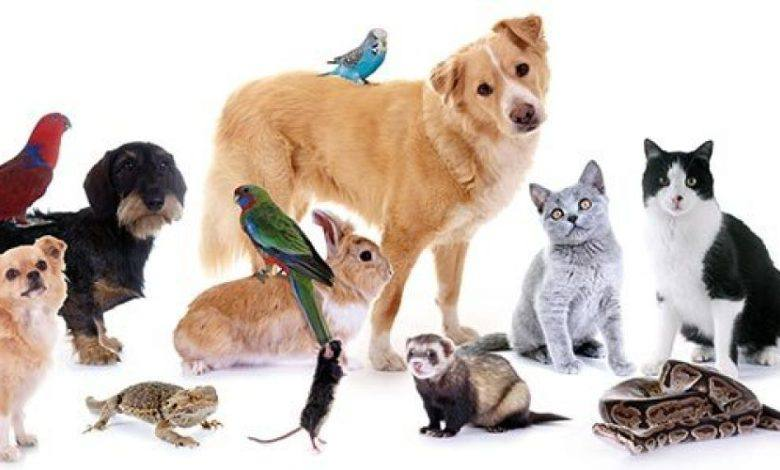
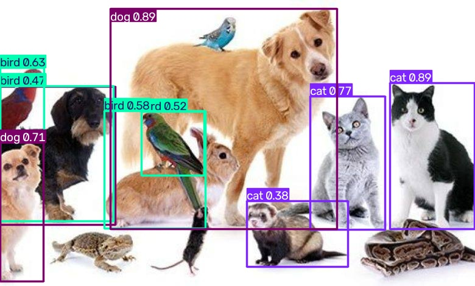
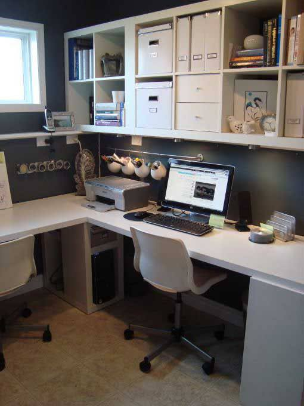
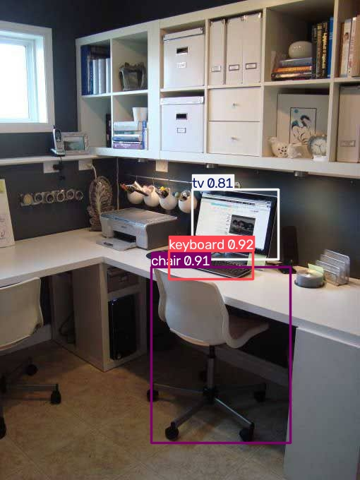
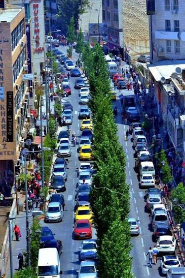
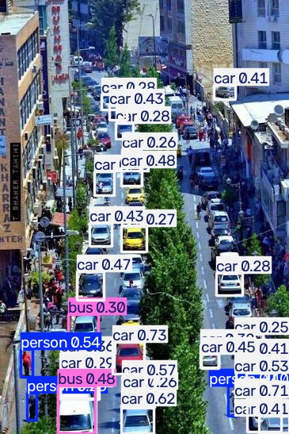

# Object Recognition using YOLOv8 and OpenCV

## Project Overview

This project demonstrates an object recognition system using the YOLOv8 deep learning model and OpenCV. The program detects multiple objects in static images, draws bounding boxes around each detected object, labels them with their corresponding class names, displays the results, and automatically saves the processed images.

---

## Project Objectives

- Learn how to use OpenCV with YOLOv8.
- Detect multiple objects in static images.
- Draw bounding boxes around detected objects.
- Display and save the processed images automatically.

---

## Technologies Used

- Python 3
- OpenCV
- Ultralytics YOLOv8

---

## Installation

Install the required libraries before running the project:
pip install ultralytics opencv-python

---

## How It Works

### Step 1
Import the required libraries.

### Step 2
Load the YOLOv8 pretrained model.
model = YOLO("yolov8n.pt")

The model is downloaded automatically the first time the program runs.

### Step 3
Read all images from the images folder.

### Step 4
Run object detection on each image.

### Step 5
Draw bounding boxes and labels around detected objects.

### Step 6
Display each processed image and wait for the user to press any key before moving to the next image.

### Step 7
Save the processed images in the output folder.

---

## Features

- Detect multiple objects in images.
- Display detection results.
- Save processed images automatically.
- Process multiple images in one run.

---

## Future Improvements

- Support video object detection.
- Real-time webcam detection.
- Display confidence scores.
- Count detected objects.

# Results

The following examples demonstrate the object recognition performance of the YOLOv8 model on three different images. Each example shows the original image followed by the detection result after applying the model.

---

## Example 1: Animals Image

The first image contains different animals. The YOLOv8 model detects the visible animals and draws bounding boxes with their corresponding class labels.

### Original Image

### Detection Result

Output

The model successfully detected the animals in the image and displayed their names with bounding boxes. The processed image was also saved automatically in the output folder.

---

## Example 2: Office Image

The second image represents an office environment containing several everyday objects. The model recognizes multiple objects and labels each detected item.

### Original Image

### Detection Result

Output

The model detected office-related objects such as laptops, keyboards, chairs, and other visible items. All detected objects were highlighted using bounding boxes.

---

## Example 3: Street Image

The third image contains a street scene with vehicles and pedestrians. The model performs object detection on the entire scene.

### Original Image

### Detection Result

Output

The model successfully identified the vehicles and pedestrians in the image. Each detected object was labeled and enclosed with a bounding box before saving the final result.
